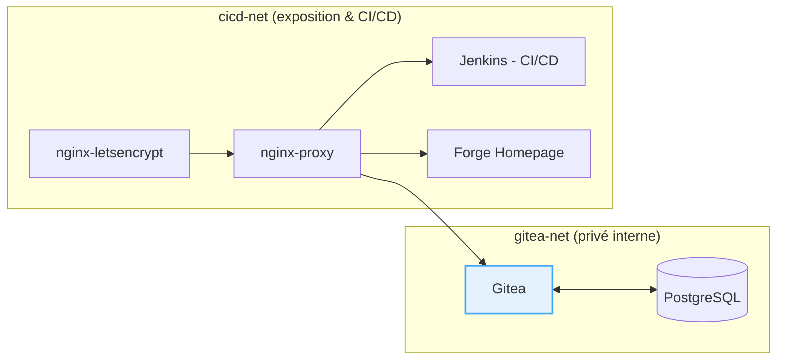

# Architecture du projet

L’environnement **Forge Docker** regroupe plusieurs services DevOps :  
une forge Git (**Gitea**), un serveur CI/CD (**Jenkins**), un reverse proxy avec certificats automatiques (**nginx-proxy** et **nginx-letsencrypt**) et une page d’accueil de type portail (**Forge Homepage**).

---

## Schéma d’interaction entre les conteneurs

> **Remarque sur la topologie :**
>
> Le conteneur **Gitea** est connecté à deux réseaux :
> - `gitea-net`, pour communiquer exclusivement avec PostgreSQL ;
> - `cicd-net`, pour être exposé par le reverse proxy.
>
> Il n’existe **aucun flux direct** entre `nginx-proxy` et `gitea-net`.  
> Seul le service Gitea établit des connexions sortantes vers PostgreSQL sur le réseau privé `gitea-net`.

---

## Réseaux Docker

| Réseau | Rôle | Conteneurs connectés |
|---------|------|----------------------|
| `gitea-net` | Réseau interne et isolé réservé à la forge | `gitea`, `gitea-db` |
| `cicd-net` | Réseau principal CI/CD et portail web | `jenkins`, `forge-homepage`, `nginx-proxy`, `nginx-letsencrypt`, `gitea` |

---

## Volumes persistants

| Service           | Volume Docker              | Description                       |
|-------------------|----------------------------|-----------------------------------|
| Gitea             | `gitea-data`               | Repositories, configuration       |
| Jenkins           | `jenkins_home`             | Jobs, builds, plugins             |
| PostgreSQL        | `postgres_data`            | Database Gitea                        |
| nginx-letsencrypt | `certs`, `vhost.d`, `html` | Certificats SSL & configurations  |

---

## Liste des conteneurs

| Nom du conteneur  | Image utilisée                     | Ports exposés | Rôle principal          |
|-------------------|------------------------------------|----------------|--------------------------|
| nginx-proxy       | `thfx31/ynov:nginx-proxy-v1`       | 80, 443        | Reverse proxy principal |
| nginx-letsencrypt | `thfx31/ynov:nginx-letsencrypt-v1` | 80, 443        | Certificats SSL         |
| gitea             | `thfx31/ynov:gitea-v1`             | 22, 3000       | Forge Git               |
| jenkins           | `thfx31/ynov:jenkins-v1`           | 8080, 50000    | Serveur CI/CD           |
| gitea-db          | `thfx31/ynov:postgres-v1`          | 5432           | Base de données         |
| forge-homepage    | `thfx31/ynov:forge-v1`             | 80             | Portail d’accueil       |

---

## Notes complémentaires

- Les conteneurs sont autonomes mais interconnectés via le réseau Docker.  
- L’ajout d’un nouveau service ne nécessite aucune modification du reverse proxy : il suffit de définir les variables `VIRTUAL_HOST` et `VIRTUAL_PORT`.  
- Les certificats SSL sont automatiquement générés et stockés dans `certs`.  
- Les volumes assurent la **persistance des données** lors des redéploiements.
